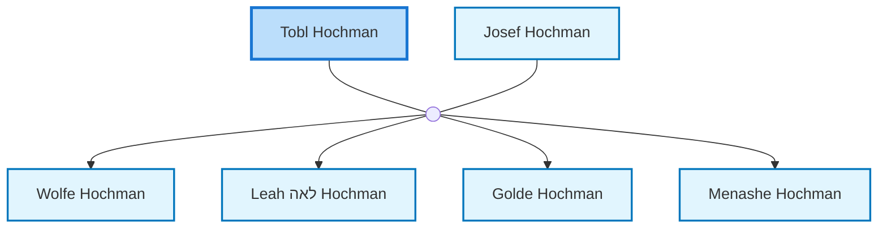

<dl class="profile-info-list">
<dt>Parents:</dt><dd>—</dd>
<dt>Siblings:</dt><dd>—</dd>
<dt>Spouse:</dt><dd><a href="/profiles/Josef-Hochman">Josef Hochman</a></dd>
<dt>Children:</dt><dd><a href="/profiles/Wolfe-Hochman">Wolfe Hochman</a>, <a href="/profiles/Leah-%D7%9C%D7%90%D7%94-Hochman">Leah לאה Hochman</a>, <a href="/profiles/Golde-Hochman">Golde Hochman</a>, <a href="/profiles/Menashe-Hochman">Menashe Hochman</a></dd>
</dl>

---

## Nuclear Family

