<dl class="profile-info-list">
<dt>Birth:</dt><dd>circa 1840 at <a href="https://en.wikipedia.org/wiki/Savran,_then_Russia,_Ukraine">Savran, then Russia, Ukraine</a></dd>
<dt>Death:</dt><dd>circa 1890 at <a href="https://en.wikipedia.org/wiki/Savran">Savran</a></dd>
<dt>Occupation:</dt><dd>Timber merchant, cartwright</dd>
<dt>Parents:</dt><dd>—</dd>
<dt>Siblings:</dt><dd>—</dd>
<dt>Spouse:</dt><dd><a href="/profiles/Beile-%D7%91%D7%99%D7%99%D7%9C%D7%90-Hochman-Elizafan">Beile ביילא Hochman Elizafan</a></dd>
<dt>Children:</dt><dd><a href="/profiles/Shimon-Meir-%D7%9E%D7%90%D7%99%D7%A8-Hochman">Shimon Meir מאיר Hochman</a>, <a href="/profiles/Yisrael-Hochman">Yisrael Hochman</a>, <a href="/profiles/Binyamin-Hochman">Binyamin Hochman</a>, <a href="/profiles/Kolman-Hochman">Kolman Hochman</a>, <a href="/profiles/Avraham-Hochman">Avraham Hochman</a>, <a href="/profiles/Moshe-%D7%9E%D7%A9%D7%94-Hoffman-Hochman">Moshe משה Hoffman Hochman</a>, <a href="/profiles/_Bobka_-Hochman">"Bobka" Hochman</a>, <a href="/profiles/Haim-Yehuda-%D7%97%D7%99%D7%99%D7%9D-%D7%99%D7%94%D7%95%D7%93%D7%94-Hochman">Haim Yehuda חיים יהודה Hochman</a>, <a href="/profiles/Josef-Hochman">Josef Hochman</a>, <a href="/profiles/Sholem-Hochman">Sholem Hochman</a></dd>
</dl>

---

## Nuclear Family

```mermaid
flowchart TD
classDef person fill:#e1f5fe,stroke:#0277bd,stroke-width:2px;
classDef internal-link fill:#e1f5fe,stroke:#0277bd,stroke-width:2px;
classDef current fill:#bbdefb,stroke:#1976d2,stroke-width:3px;
idI11032885["Wolf זאב Hochman"]
class idI11032885 current
click idI11032885 "../profiles/Wolf-%D7%96%D7%90%D7%91-Hochman" "Wolf זאב Hochman"
idI11032895["Beile ביילא Hochman Elizafan"]
class idI11032895 internal-link
click idI11032895 "../profiles/Beile-%D7%91%D7%99%D7%99%D7%9C%D7%90-Hochman-Elizafan" "Beile ביילא Hochman Elizafan"
marriage_idF3770106((" "))
idI11032885 --- marriage_idF3770106
idI11032895 --- marriage_idF3770106
idI11060285["Shimon Meir מאיר Hochman"]
class idI11060285 internal-link
click idI11060285 "../profiles/Shimon-Meir-%D7%9E%D7%90%D7%99%D7%A8-Hochman" "Shimon Meir מאיר Hochman"
marriage_idF3770106 --> idI11060285
idI39114550["Yisrael Hochman"]
class idI39114550 internal-link
click idI39114550 "../profiles/Yisrael-Hochman" "Yisrael Hochman"
marriage_idF3770106 --> idI39114550
idI39114997["Binyamin Hochman"]
class idI39114997 internal-link
click idI39114997 "../profiles/Binyamin-Hochman" "Binyamin Hochman"
marriage_idF3770106 --> idI39114997
idI39115025["Kolman Hochman"]
class idI39115025 internal-link
click idI39115025 "../profiles/Kolman-Hochman" "Kolman Hochman"
marriage_idF3770106 --> idI39115025
idI39114938["Avraham Hochman"]
class idI39114938 internal-link
click idI39114938 "../profiles/Avraham-Hochman" "Avraham Hochman"
marriage_idF3770106 --> idI39114938
idI11052340["Moshe משה Hoffman Hochman"]
class idI11052340 internal-link
click idI11052340 "../profiles/Moshe-%D7%9E%D7%A9%D7%94-Hoffman-Hochman" "Moshe משה Hoffman Hochman"
marriage_idF3770106 --> idI11052340
idI39114448["'Bobka' Hochman"]
class idI39114448 internal-link
click idI39114448 "../profiles/_Bobka_-Hochman" "'Bobka' Hochman"
marriage_idF3770106 --> idI39114448
idI11032861["Haim Yehuda חיים יהודה Hochman"]
class idI11032861 internal-link
click idI11032861 "../profiles/Haim-Yehuda-%D7%97%D7%99%D7%99%D7%9D-%D7%99%D7%94%D7%95%D7%93%D7%94-Hochman" "Haim Yehuda חיים יהודה Hochman"
marriage_idF3770106 --> idI11032861
idI38740193["Josef Hochman"]
class idI38740193 internal-link
click idI38740193 "../profiles/Josef-Hochman" "Josef Hochman"
marriage_idF3770106 --> idI38740193
idI39114787["Sholem Hochman"]
class idI39114787 internal-link
click idI39114787 "../profiles/Sholem-Hochman" "Sholem Hochman"
marriage_idF3770106 --> idI39114787
```

