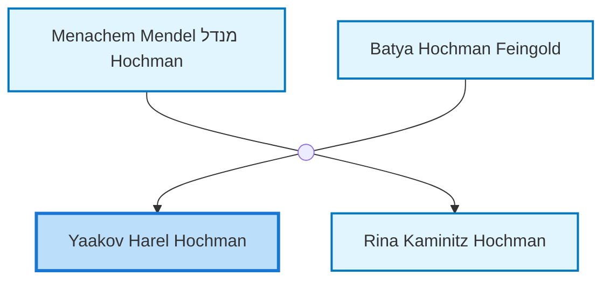
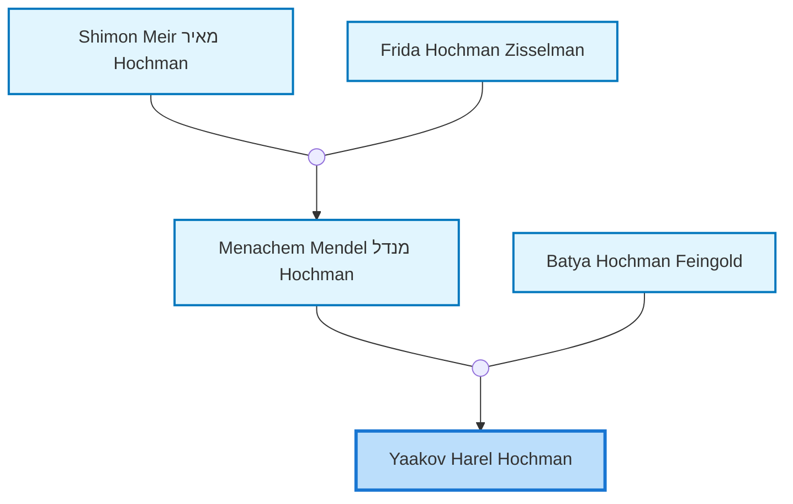
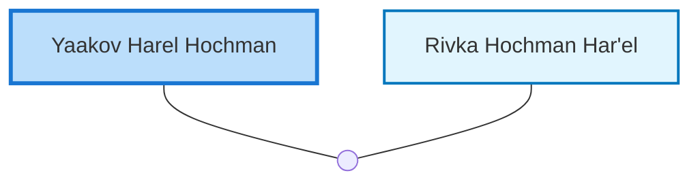

<dl class="profile-info-list">
<dt>Parents:</dt><dd><a href="/profiles/Menachem-Mendel-%D7%9E%D7%A0%D7%93%D7%9C-Hochman">Menachem Mendel מנדל Hochman</a>, <a href="/profiles/Batya-Hochman-Feingold">Batya Hochman Feingold</a></dd>
<dt>Siblings:</dt><dd><a href="/profiles/Rina-Kaminitz-Hochman">Rina Kaminitz Hochman</a></dd>
<dt>Spouse:</dt><dd><a href="/profiles/Rivka-Hochman-Har%27el">Rivka Hochman Har'el</a></dd>
<dt>Children:</dt><dd>—</dd>
</dl>

---

## Immediate Family

## Ancestors (up to 2 Gen.)

## Nuclear Family

