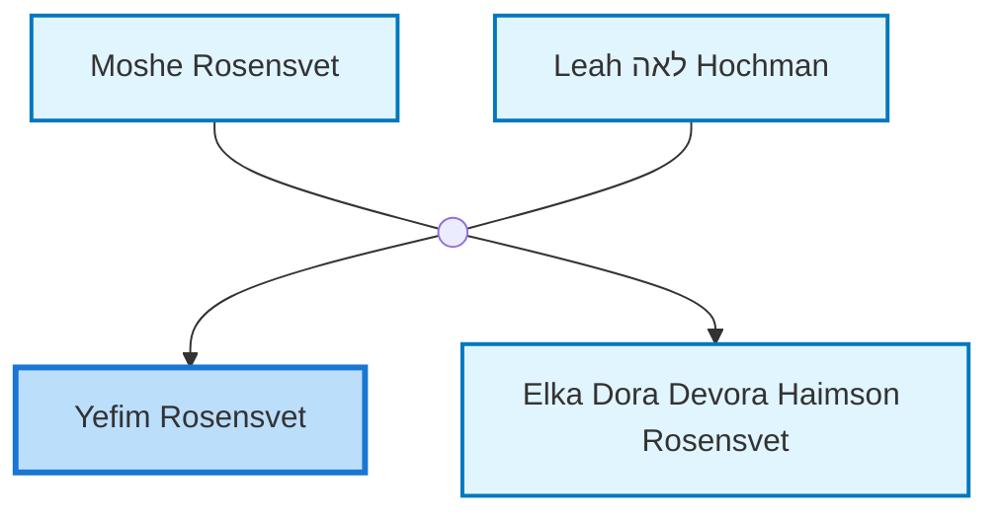
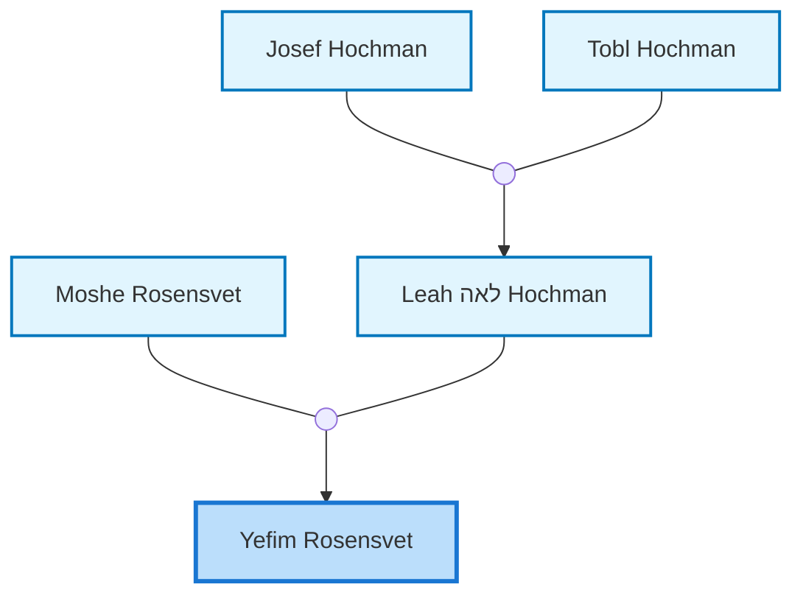
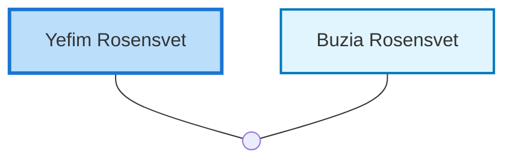

<dl class="profile-info-list">
<dt>Birth:</dt><dd>1921 at <a href="https://en.wikipedia.org/wiki/Russia_(Russian_Federation)">Russia (Russian Federation)</a></dd>
<dt>Parents:</dt><dd><a href="/profiles/Moshe-Rosensvet">Moshe Rosensvet</a>, <a href="/profiles/Leah-%D7%9C%D7%90%D7%94-Hochman">Leah לאה Hochman</a></dd>
<dt>Siblings:</dt><dd><a href="/profiles/Elka-Dora-Devora-Haimson-Rosensvet">Elka Dora Devora Haimson Rosensvet</a></dd>
<dt>Spouse:</dt><dd><a href="/profiles/Buzia-Rosensvet">Buzia Rosensvet</a></dd>
<dt>Children:</dt><dd>—</dd>
</dl>

---

## Immediate Family

## Ancestors (up to 2 Gen.)

## Nuclear Family

