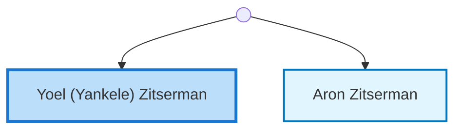
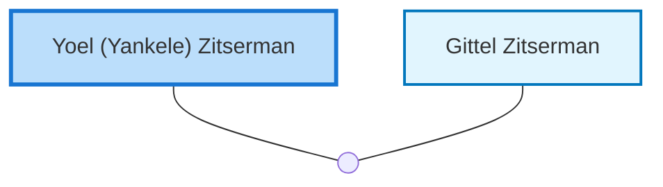

<dl class="profile-info-list">
<dt>Parents:</dt><dd>—</dd>
<dt>Siblings:</dt><dd><a href="/profiles/Aron-Zitserman">Aron Zitserman</a></dd>
<dt>Spouse:</dt><dd><a href="/profiles/Gittel-Zitserman">Gittel Zitserman</a></dd>
<dt>Children:</dt><dd>—</dd>
</dl>

---

## Immediate Family

## Nuclear Family

