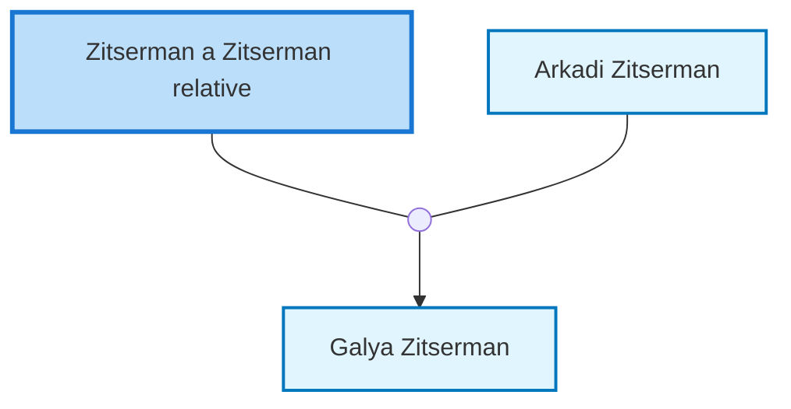

<dl class="profile-info-list">
<dt>Parents:</dt><dd>—</dd>
<dt>Siblings:</dt><dd>—</dd>
<dt>Spouse:</dt><dd><a href="/profiles/Arkadi-Zitserman">Arkadi Zitserman</a></dd>
<dt>Children:</dt><dd><a href="/profiles/Galya-Zitserman">Galya Zitserman</a></dd>
</dl>

---

## Nuclear Family

